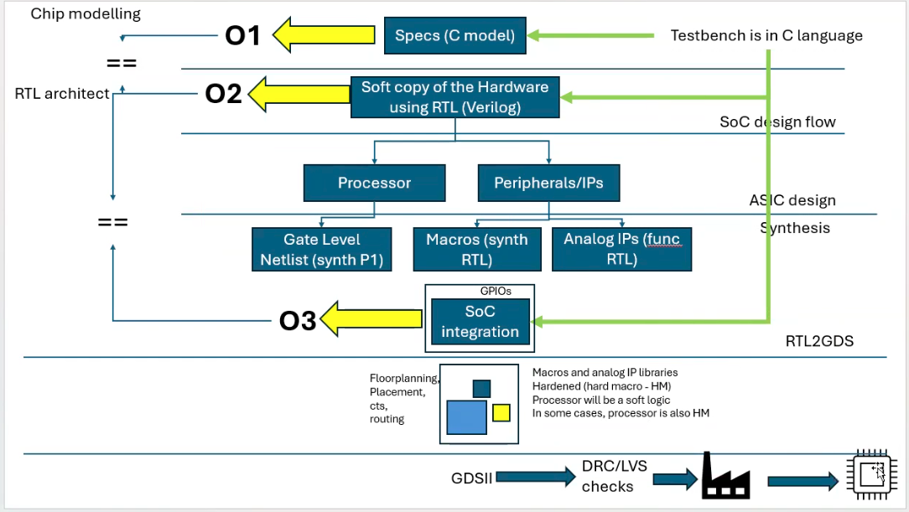

# soc-design

## Day 1

1. Chip Modelling:
   We start by writing a C program, which can be either a testbench or an application. This program is compiled using a GCC compiler, producing an output (O0). We compare this output with a specification model (O1) to ensure that the system design aligns with the initial requirements.

2. RTL Architecture:
   Next, we create a soft copy of the hardware using high-level languages like Bluespec or Chisel, which bridge the gap between software and hardware description languages (HDL). The output of this stage (O2) is compared with O1 to make sure everything matches.

3. Design:
   Based on the requirements, we select or design the processor and choose peripherals and intellectual properties (IP) like GPIOs, ADCs, PLLs, connectors, and more. Then, we synthesize these components, generating a gate-level netlist from the synthesizable RTL. We do this for both the processor and other components like macros and analog IPs.

4. SoC Integration:
   After synthesis, we integrate all the components to form a System on Chip (SoC). The output from this integration is compared with O2 to ensure consistency.

5. RTL to GDS II:
   This is where the chip layout is finalized. We perform several tasks: floor planning, placement, clock tree synthesis (CTS), routing, and timing closure. The result is a layout of the chip. This layout undergoes verification through Design Rule Checks (DRC) and Layout Versus Schematic (LVS) checks to ensure it's error-free. Once validated, we generate the GDS II file, which is sent to the foundry for chip fabrication.

6. Final Steps:
   After the chips are manufactured, they are packaged according to our specifications. The chips are then tested by integrating all the components to ensure they function as required by the user.